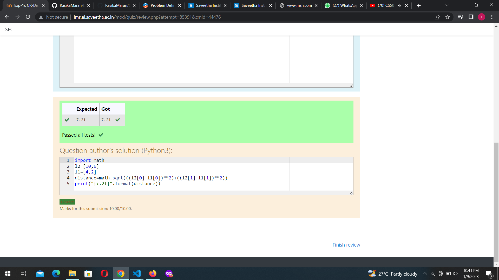

# DISTANCE-BETWEEN-TWO-POINTS

## AIM:
To write a python program to find the distance two 2 points
## ALGORITHM:
### Step 1:
Get a value from the user

### Step 2:
Assign the values

### Step 3: 
Substitute the values in the distance formula  

### Step 4: 
Print the results

### Step 5: 
End the program

### PROGRAM:
 ```python
  #Program to find the distance between two points.
#Developed by: rasika.m
#RegisterNumber:22005459
import math as m
l1=[4,2]
l2=[10,6]
d=m.sqrt((l2[0]-l1[0])**2+(l2[1]-l1[1])**2)
print("{:.2f}".format(d))
```

### OUTPUT:


### RESULT:
Thus the distance between the teo points are successfully solved usuing python program
